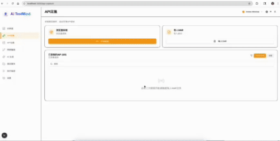
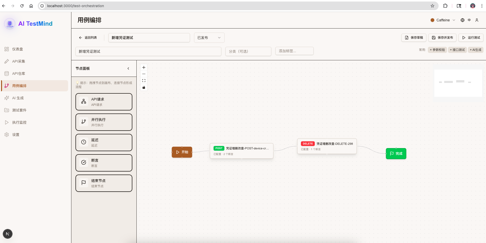
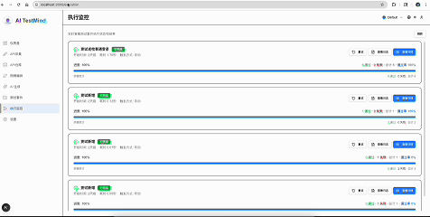
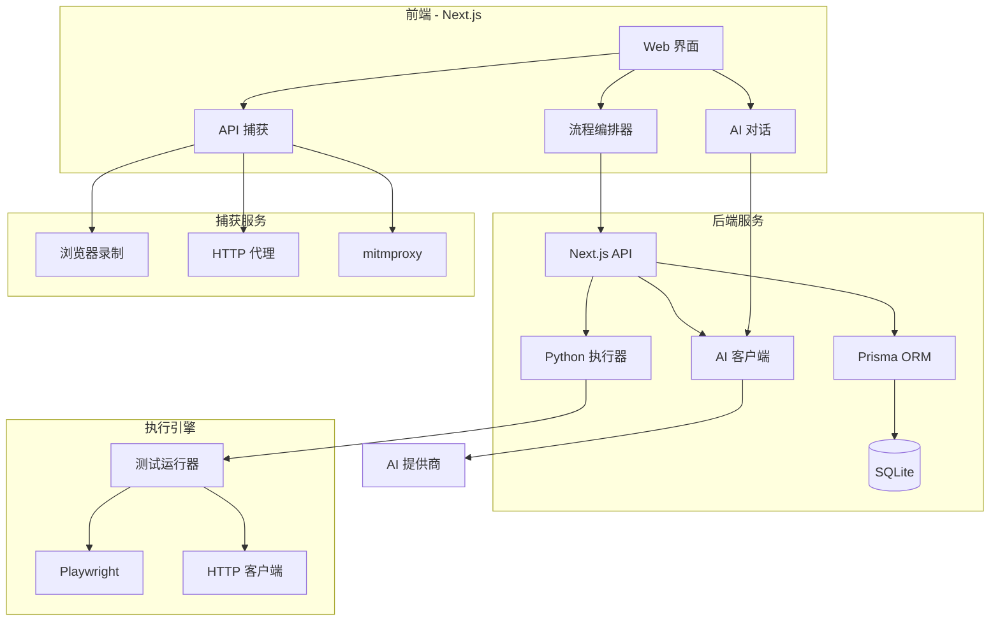
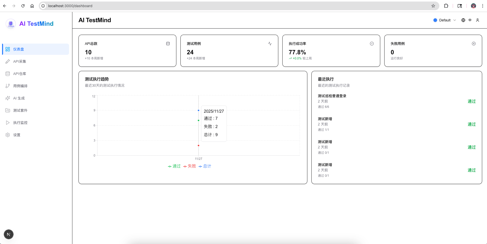
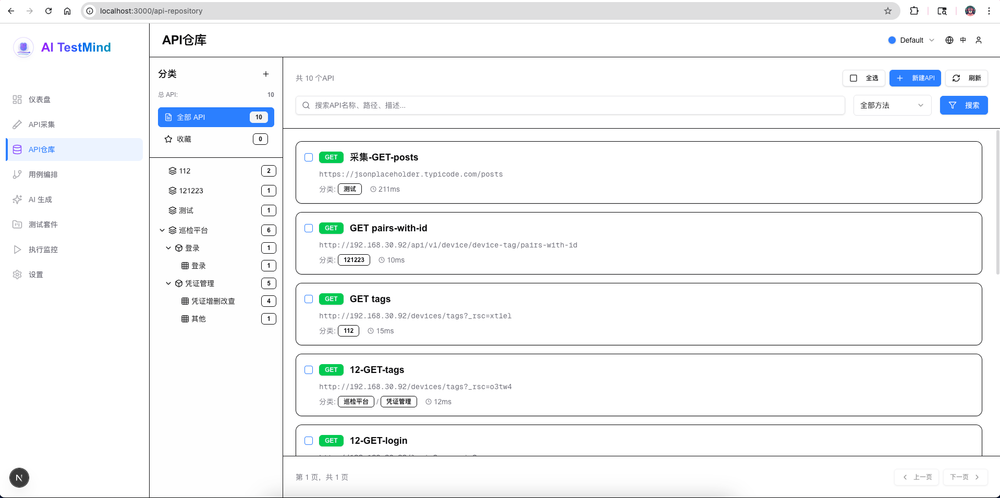
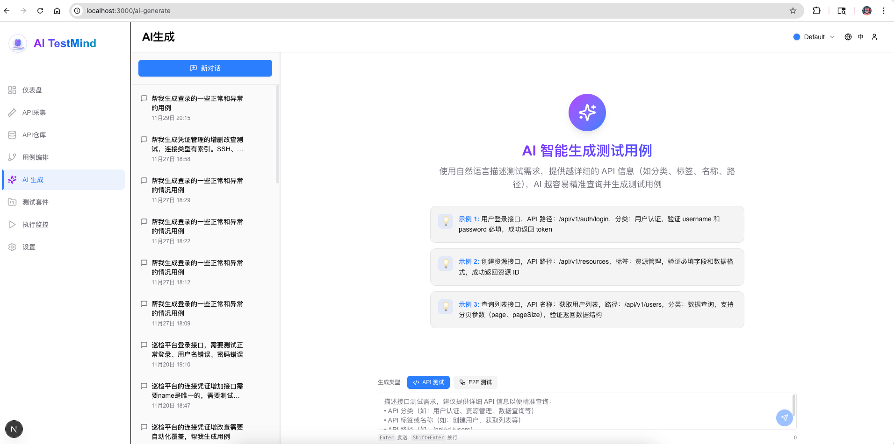
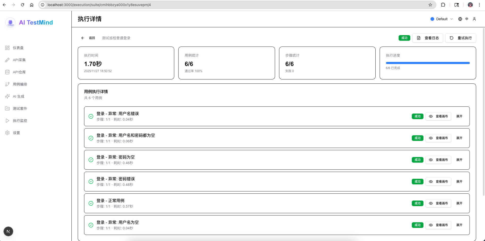
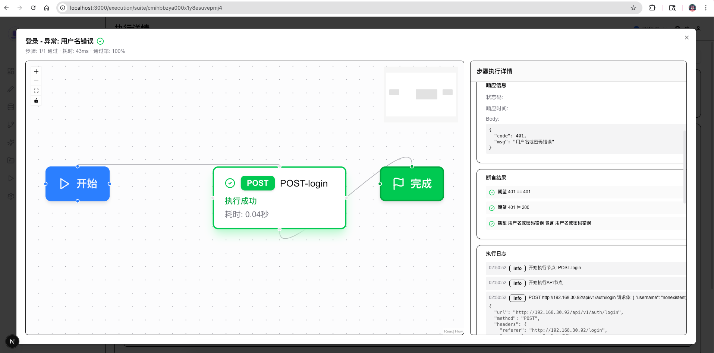

<div align="center">


<h1>🧠 AI TestMind</h1>

<p><strong>像思考一样编排，用智能来测试</strong></p>
<p>AI 驱动的可视化 API 测试编排平台</p>

<!-- 徽章墙 -->
[](https://github.com/bobby-sheng/aitestmind/stargazers)
[](https://discord.gg/Kys4DcgNeC)
[](LICENSE)
[](https://hub.docker.com/r/simonbo106/aitestmind)
[](https://hub.docker.com/r/simonbo106/aitestmind)
[](https://nextjs.org/)
[](https://www.typescriptlang.org/)
[](https://openai.com)

<p>
  <a href="#-快速开始">🚀 快速开始</a> •
  <a href="docs/README.md">📖 文档</a> •
  <a href="#-社区">💬 社区</a> •
  <a href="https://github.com/bobby-sheng/aitestmind/issues">🐛 报告问题</a>
</p>

<p>
  <strong>多语言:</strong>
  <a href="README_EN.md">English</a> |
  <a href="README.md">中文</a>
</p>

</div>

---

## 🎯 开发初衷

**痛点：**
作为一名测试工程师和开发者，我曾尝试过市面上各种测试平台 - 从 Postman、JMeter 到 MeterSphere、Katalon，也试过自己编写自动化测试代码。但它们都存在同样的问题：

- 📝 **手工劳动太多**：为类似的场景重复编写测试代码
- 🐌 **效率太低**：创建简单的 API 测试都要花费数小时
- 🔄 **复用性差**：在不同测试用例间反复复制粘贴代码
- 🧩 **学习成本高**：复杂的工具需要几周时间才能上手

**解决方案：**
我决定打造一个我一直梦想拥有的测试平台。AI TestMind 源于我多年的自动化测试实践经验 - 它是我自己测试框架的进化版本，专为消除重复劳动、让测试用例编写变得舒适高效而设计。

**成果：**
- ⚡ **快速**：几分钟内创建复杂测试流程，而非几小时
- 🎨 **可视化**：无需编码 - 只需拖拽、连接
- 🤖 **智能**：AI 理解你的意图，自动生成完整测试
- 😊 **愉悦**：终于有了一款真正好用的测试工具

---

## 🚀 快速开始

### 🐳 **方式 1: Docker 部署（推荐）**

#### 方式 A: 从 Docker Hub 拉取（最快）

```bash
docker run -d \
  --name aitestmind \
  -p 3000:3000 \
  -p 8001:8001 \
  -p 8899:8899 \
  -e DATABASE_URL="file:/app/prisma/dev.db" \
  -e EXECUTOR_URL="http://localhost:8001" \
  -v $(pwd)/logs:/app/logs \
  simonbo106/aitestmind:latest

# 访问应用
open http://localhost:3000
```

> **📦 Docker Hub:** https://hub.docker.com/r/simonbo106/aitestmind
> 
> **⚠️ 注意：** Docker Hub 镜像针对 ARM64 优化，x86_64 服务器请使用方式 B 本地构建

#### 方式 B: 本地构建 Docker（服务器部署推荐）

```bash
# 1. 克隆仓库
git clone https://github.com/bobby-sheng/aitestmind.git
cd aitestmind

# 2. 构建镜像（⚠️ 必须指定服务器 IP）
docker build -f Dockerfile.all-in-one \
  --build-arg NEXT_PUBLIC_EXECUTOR_URL=http://你的服务器IP:8001 \
  -t aitestmind:latest .

# 3. 运行容器
docker run -d \
  --name aitestmind \
  -p 3000:3000 \
  -p 8001:8001 \
  -p 8899:8899 \
  -e DATABASE_URL=file:/app/prisma/dev.db \
  -v $(pwd)/logs:/app/logs \
  --restart unless-stopped \
  aitestmind:latest
```

> **💡 为什么要本地构建？**
> - 支持自定义 `NEXT_PUBLIC_EXECUTOR_URL`（浏览器访问执行器的地址）
> - 适配不同 CPU 架构（x86_64/AMD64）
> - 如果浏览器提示 `Failed to fetch`，说明需要重新构建并指定正确的服务器 IP

---

### 💻 **方式 2: 本地启动**

```bash
# 1. 克隆仓库
git clone https://github.com/bobby-sheng/aitestmind.git
cd aitestmind

# 2. 运行初始化脚本（自动完成所有配置和构建）
chmod +x setup.sh
./setup.sh

# 3. 启动前端（终端 1）
npm run start

# 4. 启动执行器（终端 2）
cd executor
source venv/bin/activate
python main.py
```

**📝 默认管理员账号：** `admin / admin123`

**🎉 完成！** 访问 http://localhost:3000

---

## 💡 什么是 AI TestMind？

**AI TestMind** 是新一代 API 测试平台,通过 **三大核心能力** 革新测试工作流：

<div align="center">

### 🎯 三大核心能力

```
🎬 AI 智能采集  ──▶  🎨 可视化编排  ──▶  🤖 AI 生成用例  ──▶  ✅ 测试完成
   零配置获取          拖拽构建流程       自然语言生成        一键执行
```

</div>

### ✨ 完整工作流程

#### 1️⃣ **AI 智能采集** - 零配置获取 API
```
访问网站 → AI 自动识别 API → 
智能分类 → 生成 Schema → 保存到 API 仓库

🎬 3 种采集模式：
  • 浏览器插件（Playwright）- 最简单
  • HAR 文件导入 - 最快速  
  • mitmproxy 代理 - 最专业
```

#### 2️⃣ **可视化编排** - 拖拽构建测试流程
```
从 API 仓库选择接口 → 拖拽到画布 → 
连接节点 → 配置参数 → 添加断言 → 保存用例

🎨 支持复杂场景：
  • 变量引用和传递
  • 并行执行
  • 断言和等待
```

#### 3️⃣ **AI 生成用例** - 自然语言秒变测试
```
描述需求："测试用户登录后创建订单"
              ↓
    [AI 智能思考：搜索 API + 设计流程 + 生成断言]
              ↓
┌────────┐   ┌──────┐   ┌───────┐
│ 登录   │──▶│ 购物车│──▶│ 下单  │
│ API    │   │ API  │   │ API   │
└────────┘   └──────┘   └───────┘
  ✅ 断言      ✅ 提取     ✅ 清理
  状态=200    token      删除订单
  
📁 自动统一分类：所有生成的用例归属同一业务分类
🏷️ 智能标签：自动标记测试类型和场景
```

---

## 🌟 AI TestMind优势

### 🚀 **测试创建速度提升 10 倍**

| 功能特性 | AI TestMind | Postman | JMeter | MeterSphere | Katalon |
|---------|------------|---------|--------|-------------|---------|
| **🤖 AI 智能生成** | ✅ GPT-4 驱动 | ❌ 手动编写 | ❌ 手动编写 | ❌ 手动编写 | ⚠️ 有限支持 |
| **🎨 可视化流程** | ✅ 拖拽式 | ⚠️ 有限 | ❌ XML/代码 | ⚠️ 有限 | ✅ 支持 |
| **📊 实时监控** | ✅ 实时仪表盘 | ⚠️ 执行后 | ✅ 支持 | ✅ 支持 | ⚠️ 有限 |
| **🎬 智能捕获** | ✅ 3 种模式 | ⚠️ 仅浏览器 | ❌ 手动 | ⚠️ 仅 HAR | ⚠️ 基础 |
| **🧩 学习曲线** | 🟢 **5 分钟** | 🟡 1 小时 | 🔴 2 天 | 🟡 2 小时 | 🟡 1 天 |
| **🌐 多语言** | ✅ 中英文 | ✅ 多语言 | ⚠️ 有限 | ✅ 中英文 | ✅ 多语言 |
| **💰 成本** | 🟢 **免费开源** | 🟡 部分免费 | 🟢 免费 | 🟢 开源 | 🔴 付费 |

### 🎯 **核心优势**

#### 🏆 三大杀手级功能

| 功能 | 传统方式 | AI TestMind | 效率提升 |
|------|---------|-------------|---------|
| 🎬 **API 采集** | 手动记录 URL 和参数 | AI 自动识别和分类 | **10x** |
| 🎨 **流程编排** | 编写脚本代码 | 拖拽可视化构建 | **20x** |
| 🤖 **用例生成** | 逐个手写测试用例 | 自然语言一键生成 | **50x** |

#### ✨ 更多特性

- ⚡ **实时反馈**: 实时查看测试执行和详细日志
- 📁 **智能分类**: 自动统一管理测试用例分类
- 🌍 **多语言**: 内置中英文支持
- 🎨 **主题定制**: 支持明暗主题切换，可自定义配色方案
- 🔧 **可扩展**: 插件系统和自定义函数
- 🐳 **易部署**: Docker、Windows、Linux、macOS

---

## ✨ 核心功能详解

> **完整工作流**: 🎬 采集 API → 🎨 编排流程 → 🤖 AI 生成 → ✅ 执行测试

---

### 1️⃣ 🎬 **AI 智能采集 - 零配置获取 API**

<div align="center">

</div>

**三种采集模式，适应不同场景：**

#### 🌐 **模式 1: Playwright 浏览器插件**（推荐新手）
```bash
# 访问前端页面进行采集
访问 http://localhost:3000/api-capture
选择 "Playwright 浏览器录制" → 输入目标 URL → 点击 "开始录制"
```
- ✅ **最简单**: 无需任何配置
- ✅ **可视化**: 实时看到采集的 API
- ✅ **智能过滤**: 自动过滤静态资源
- ✅ **分类识别**: AI 自动识别 API 业务分类

#### 📦 **模式 2: HAR 文件导入**（最快速）
```
导出 HAR 文件 → 拖拽上传 → 智能解析 → 保存到仓库
```
- ⚡ **秒级导入**: 支持批量导入
- 🎯 **精准提取**: 请求/响应完整保留
- 📊 **智能分组**: 自动按域名和路径分类

#### 🔒 **模式 3: mitmproxy 代理**（最专业）

**适用场景:**
- 📱 移动应用（iOS/Android APP）
- 💬 小程序（微信、支付宝）  
- 🌐 浏览器 HTTPS 流量
- 🖥️ 桌面应用程序

**快速启动:**
```bash
# 1. 在 Web 界面启动
访问 http://localhost:3000/api-capture
选择 "mitmproxy 代理录制" → 点击 "启动录制"

# 2. 配置系统代理
macOS: 系统设置 → 网络 → 代理 → HTTP/HTTPS → localhost:8899
Windows: 设置 → 网络 → 代理 → 手动 → localhost:8899

# 3. 安装 HTTPS 证书（首次使用）
访问 http://mitm.it → 下载对应平台证书 → 安装并信任

# 4. 开始捕获
访问任何网站或启动 APP → 实时查看捕获的请求
```

**🌐 独立 Chrome 浏览器代理（推荐）:**

不影响现有浏览器，启动一个独立的 Chrome 实例挂载代理：

```bash
# Windows (CMD)
start chrome --proxy-server="你的服务器IP:8899" --user-data-dir="C:\Temp\ChromeProxyProfile"

# Windows (PowerShell)
& "C:\Program Files\Google\Chrome\Application\chrome.exe" --proxy-server="你的服务器IP:8899" --user-data-dir="C:\Temp\ChromeProxyProfile"

# macOS
/Applications/Google\ Chrome.app/Contents/MacOS/Google\ Chrome --proxy-server="你的服务器IP:8899" --user-data-dir="/tmp/ChromeProxyProfile"

# Linux
google-chrome --proxy-server="你的服务器IP:8899" --user-data-dir="/tmp/ChromeProxyProfile"
```

> 💡 `--user-data-dir` 参数创建独立的浏览器配置，不会加载主浏览器的书签、扩展和登录状态，实现彻底隔离。

**核心特性:**
- 🔐 **HTTPS 完整支持**: 自动解密 HTTPS 流量
- 📊 **实时推送**: SSE 技术实时显示捕获的请求
- 🎯 **精确控制**: 启动、暂停、继续、停止、清空
- 🗂️ **完整数据**: 请求/响应头、参数、Body 全记录
- 💾 **批量保存**: 选中请求批量保存到 API 仓库

📖 **详细文档**: [mitmproxy 完整使用指南 →](docs/user-guide/05_API_CAPTURE.md#mitmproxy-模式)

**采集后自动完成:**
- 📝 生成完整的 API Schema（参数、类型、示例值）
- 🏷️ 智能分类标签
- 💾 保存到 API 仓库，随时可用

[📖 详细教程 →](docs/user-guide/05_API_CAPTURE.md)

---

### 2️⃣ 🎨 **可视化编排 - 拖拽构建测试流程**

<div align="center">

</div>

**从 API 仓库到测试用例，只需拖拽：**

#### 🎯 **5 分钟构建复杂测试场景**

```
1. 从左侧 API 仓库拖拽接口到画布
2. 连接节点，配置参数
3. 添加断言和变量提取
4. 保存，立即可执行
```

**强大的编排能力:**
- 🎯 **多种节点**: API、并发、等待、断言
- 🔗 **智能引用**: 拖拽即可引用前置节点的响应数据
- ✅ **丰富断言**: 状态码、JSONPath、响应时间、正则表达式
- 🔀 **流程控制**: 串行、并行执行
- 💾 **实时保存**: 自动保存，支持撤销/重做

**节点类型:**
- 🌐 **API 节点**: 发送 HTTP 请求
- ⚡ **并发节点**: 同时执行多个 API
- ⏰ **等待节点**: 延迟执行
- ✅ **断言节点**: 验证响应数据

**变量系统:**
- 📤 **响应提取**: JSONPath、正则、全量提取
- 📥 **变量引用**: \`{{变量名}}\` 语法
- 🔄 **变量传递**: 跨节点自动传递
- 🎲 **运行时函数**: \`${{random(8)}}、${{timestamp()}}\`

[📖 详细教程 →](docs/user-guide/04_FLOW_ORCHESTRATION.md)

---

### 3️⃣ 🤖 **AI 生成用例 - 自然语言秒变测试**

<div align="center">

</div>

**只需简单描述，AI 自动生成完整测试用例：**

#### 💬 **示例 1: 接口测试**
```
输入: "测试用户创建接口，username 和 email 不能为空"

AI 自动生成:
✅ 用户创建 - 正常用例（含后置清理）
✅ 用户创建 - username 为空
✅ 用户创建 - email 为空

📁 统一分类: 用户管理
🏷️ 标签: ["参数校验", "接口测试", "AI生成"]
```

#### 💬 **示例 2: E2E 流程测试**
```
输入: "测试用户登录后创建订单的完整流程"

AI 自动生成:
✅ E2E - 用户登录 - 创建订单（3个步骤，含清理）
✅ E2E - 用户登录 - 查询订单（2个步骤）
✅ E2E - 异常: 未登录创建订单（1个步骤）

📁 统一分类: 订单管理
🏷️ 标签: ["E2E测试", "流程测试", "AI生成"]
```

**AI 自动完成:**
- 🔍 **智能搜索**: 从 API 仓库搜索相关接口
- 🎯 **场景设计**: 生成正常 + 异常用例
- 📁 **统一分类**: 同批生成的用例使用相同分类
- ✅ **智能断言**: 自动添加合理的断言
- 🔗 **变量引用**: 自动识别和配置变量传递
- 🧹 **后置清理**: 为成功用例添加清理步骤
- 💾 **直接保存**: 一键保存到数据库

**支持的 AI 提供商:**
- OpenAI (GPT-4, GPT-3.5)
- DeepSeek（深度求索）⚡ 性价比首选
- Claude (Anthropic)
- 百度文心一言
- 阿里通义千问
- 智谱 AI
- Ollama（本地部署，完全免费）

[📖 详细教程 →](docs/user-guide/03_AI_GENERATION.md)

---

### 4️⃣ 📊 **实时执行监控 - 全链路可观测**

<div align="center">

</div>

**实时查看测试执行过程:**

- 📊 **实时仪表盘**: 通过 SSE 实时状态更新
- 🎯 **节点级日志**: 点击任意节点查看详细执行信息
- ⏸️ **暂停/继续**: 控制执行流程
- 🔄 **失败重试**: 一键重试失败的测试
- 📝 **详细报告**: 请求/响应、耗时、断言结果
- 📈 **执行历史**: 追踪趋势变化

---

## 🏗️ 技术架构

### 🔧 **技术栈**

**前端:**
```
Next.js 16 + React 19 + TypeScript
├── UI 组件: shadcn/ui + Tailwind CSS 4.0
├── 主题系统: 支持明暗主题切换，可自定义配色
├── 流程编辑器: React Flow
├── 状态管理: React Query + Context
└── 国际化: next-intl
```

**后端:**
```
Node.js + Python
├── API 路由: Next.js API Routes
├── 数据库: SQLite + Prisma ORM
├── 执行引擎: Python (FastAPI)
├── 自动化: Playwright
└── 捕获服务: mitmproxy
```

**AI 集成:**
```
多提供商支持
├── OpenAI (GPT-4, GPT-3.5)
├── DeepSeek（深度求索）
├── Claude
├── 百度文心一言
├── 阿里通义千问
├── 智谱 AI
└── Ollama（本地部署）
```

### 📐 **系统架构图**



---

## 🎬 截图与演示

### 📸 **产品截图**

<details>
<summary>📊 <strong>仪表盘</strong> - 概览和统计分析</summary>



</details>

<details>
<summary>🗂️ <strong>API 仓库</strong> - 管理 API 集合</summary>



</details>

<details>
<summary>🤖 <strong>AI 生成</strong> - 自然语言生成测试</summary>



</details>

<details>
<summary>🎨 <strong>流程编排器</strong> - 可视化测试编排</summary>


</details>

<details>
<summary>📊 <strong>执行监控</strong> - 实时测试执行</summary>





</details>


## 🎯 使用场景

### ✅ **电商测试**

```
测试场景: 完整购买流程
├── 用户登录
├── 浏览商品
├── 加入购物车（并发）
│   ├── 商品 A
│   ├── 商品 B
│   └── 商品 C
├── 使用优惠券
├── 结算
├── 支付
└── 清理: 删除测试订单 ✨
```

### ✅ **微服务测试**

```
测试场景: 服务编排
├── 认证服务
│   └── 提取: accessToken
├── 用户服务（并发）
│   ├── 创建资料
│   ├── 更新偏好
│   └── 上传头像
├── 通知服务
│   └── 断言: 邮件已发送
└── 审计服务
    └── 验证: 所有操作已记录
```

### ✅ **CI/CD 集成**

```yaml
# .github/workflows/api-tests.yml
name: API 测试
on: [push, pull_request]

jobs:
  test:
    runs-on: ubuntu-latest
    steps:
      - uses: actions/checkout@v2
      - name: 运行 AI TestMind 测试
        run: |
          docker-compose up -d
          npm run test:api
```

---

## 🌟 用户评价

> **"AI TestMind 让我们的测试效率提升了 300%！AI 生成功能改变了游戏规则。"**
> 
> — 某电商平台高级测试工程师

> **"终于有一个真正理解自然语言的测试工具了。可视化流程编排让复杂场景变得简单。"**
> 
> — 某 SaaS 公司技术负责人

> **"我们用 AI TestMind 替换了 3 个工具。实时监控和详细日志每天为我们节省数小时。"**
> 
> — 某金融科技创业公司 DevOps 经理

---

## 📊 项目统计

<div align="center">


</div>

---

## 📚 文档与配置

### 📖 **文档中心**

| 文档 | 说明 |
|------|------|
| [Docker 快速开始](docs/deployment/QUICK_START_DOCKER.md) | Docker 部署指南 |
| [完整部署指南](docs/deployment/DEPLOYMENT_GUIDE.md) | 详细部署文档 |
| [环境变量说明](env.example) | 配置选项说明 |
| [文档中心](docs/README.md) | 完整文档索引 |

### ⚠️ **常见问题：执行器连接失败**

如果浏览器提示 `Failed to fetch` 或 `执行器地址是否正确: http://localhost:8001`：

**原因：** `NEXT_PUBLIC_EXECUTOR_URL` 配置不正确

**解决方法：**

```bash
# 1. 修改 .env 文件中的执行器地址为服务器 IP
NEXT_PUBLIC_EXECUTOR_URL=http://你的服务器IP:8001

# 2. 重新构建（重要！NEXT_PUBLIC_ 变量在构建时嵌入）
npm run build

# 3. 重启服务
npm run start
```

> **💡 提示：** Docker 部署时需要在构建时传入 `--build-arg NEXT_PUBLIC_EXECUTOR_URL=http://你的服务器IP:8001`

---

## 🤝 贡献指南

我们欢迎社区贡献！🎉

### 🌟 **如何贡献**

1. 🍴 Fork 本仓库
2. 🌿 创建特性分支 (`git checkout -b feature/amazing-feature`)
3. 💾 提交你的改动 (`git commit -m 'feat: 添加某个很棒的功能'`)
4. 📤 推送到分支 (`git push origin feature/amazing-feature`)
5. 🎉 开启 Pull Request

### 📝 **贡献规范**

- 遵循 [约定式提交](https://www.conventionalcommits.org/zh-hans/)
- 为新功能编写测试
- 更新相关文档
- 确保 CI 通过

---

## 💬 社区

加入我们不断壮大的社区！

### 🌍 **国际社区 International Community**

<div align="center">

[](https://discord.gg/Kys4DcgNeC)

**[🎮 加入 Discord 服务器 | Join our Discord Server](https://discord.gg/Kys4DcgNeC)**

在 Discord 上与全球开发者交流，获取技术支持、分享经验、参与项目讨论！

</div>

### 🇨🇳 **中文社区 Chinese Community**

<div align="center">

| 微信群 WeChat Group | 飞书群 Feishu Group |
|:---:|:---:|
|  |  |
| 扫码加入微信群 | 扫码加入飞书群 |

</div>

### 💡 **社区活动**

- 📢 **每周技术分享**：最新功能介绍和最佳实践
- 🐛 **Bug 反馈与讨论**：快速响应和解决问题
- 💬 **用户交流**：分享使用经验和测试技巧
- 🎯 **功能建议**：参与产品路线图讨论
- 🏆 **贡献者表彰**：感谢社区贡献

---

## ⭐ Star 历史

[](https://star-history.com/#bobby-sheng/aitestmind&Date)

---

## 📄 开源协议

本项目采用 **非商业使用协议** - 详见 [LICENSE](LICENSE) 文件

### ✅ 允许的使用

- 📚 **个人学习**：学习、研究、实验
- 🎓 **教育用途**：教学、培训、学术研究
- 🏠 **个人项目**：个人使用，不用于盈利

### ❌ 禁止的使用

- 🏢 **商业使用**：公司、企业、商业项目
- 💰 **盈利服务**：提供付费服务、SaaS 平台
- 🔄 **二次销售**：销售、分发给商业客户

### 💼 商业使用许可

如果你需要将本项目用于商业目的：
- 🏢 企业内部使用
- 💰 提供商业服务
- 🔧 客户定制开发

请联系作者获取商业授权：
- 📧 邮箱 Email：simonboz@outlook.com
- 💬 微信 WeChat:

<div align="center">

<p>扫码添加微信 | Scan to add WeChat</p>
</div>

---

## 🙏 致谢

由 AI TestMind 团队和贡献者用 ❤️ 构建

**灵感来源:**
- [MeterSphere](https://metersphere.io) - 一站式测试平台
- [Postman](https://postman.com) - API 开发平台
- [n8n](https://n8n.io) - 工作流自动化
- [Playwright](https://playwright.dev) - 浏览器自动化

**特别感谢:**
- 所有[贡献者](https://github.com/bobby-sheng/aitestmind/graphs/contributors)
- 开源社区
- 早期采用者和测试者
- AI 提供商（OpenAI、DeepSeek 等）

---


### ⭐ **如果 AI TestMind 对你有帮助，请给我们一个 Star！** ⭐

**像思考一样编排，用智能来测试** 🧠

由开发者用心打造，为开发者服务

[⬆ 返回顶部](#-ai-testmind)

</div>

