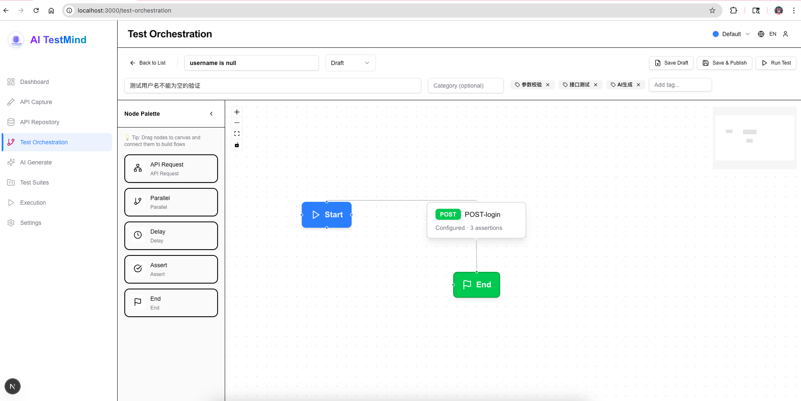
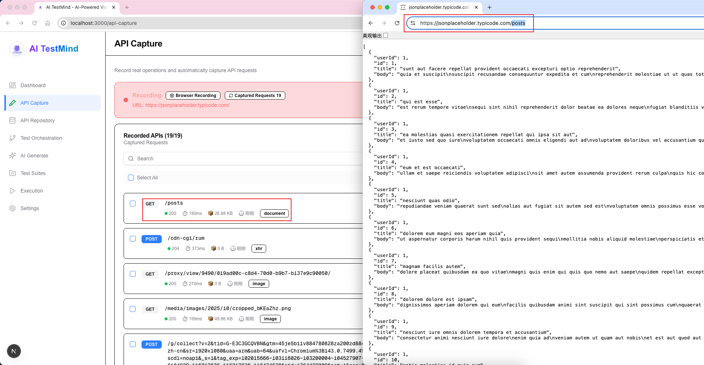
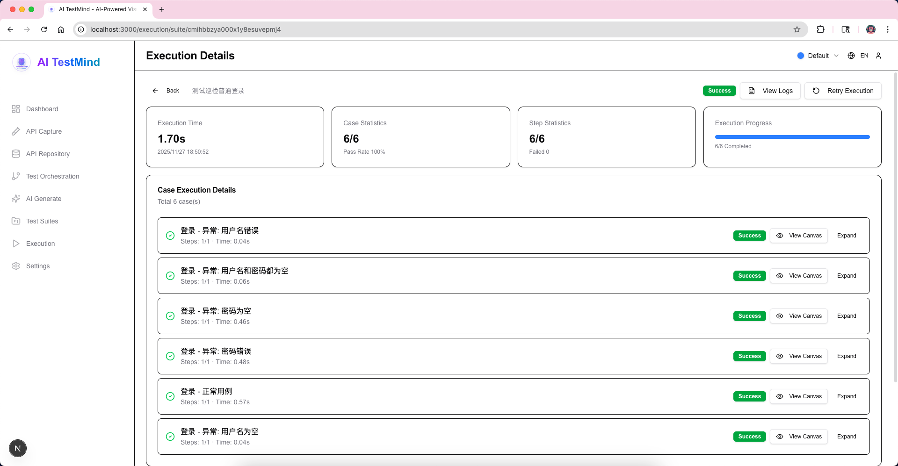
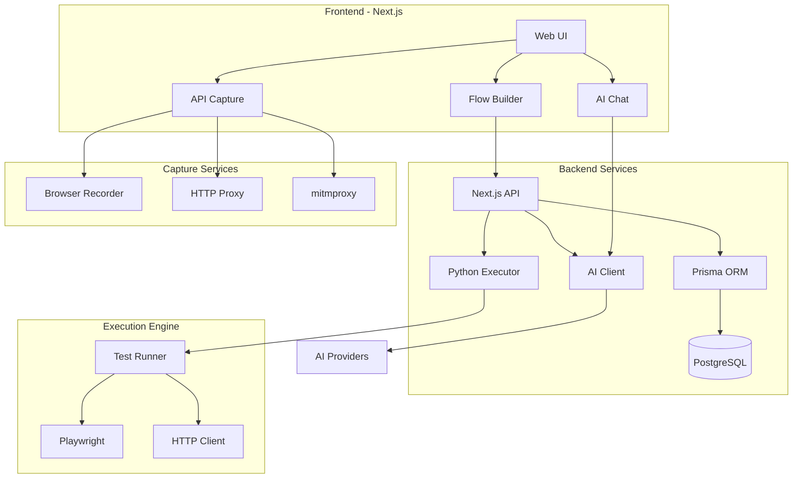
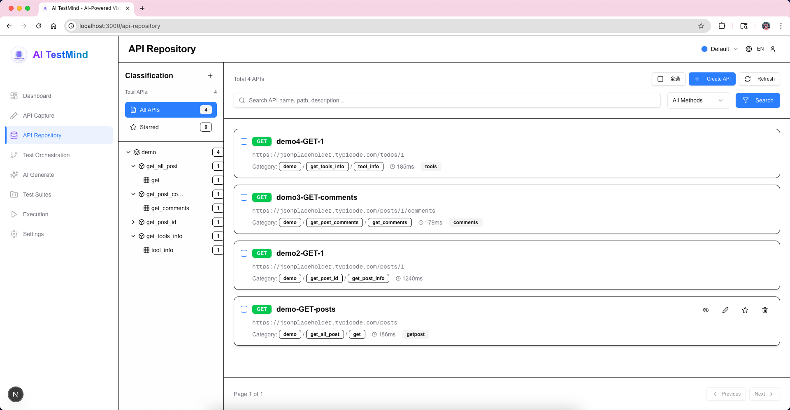
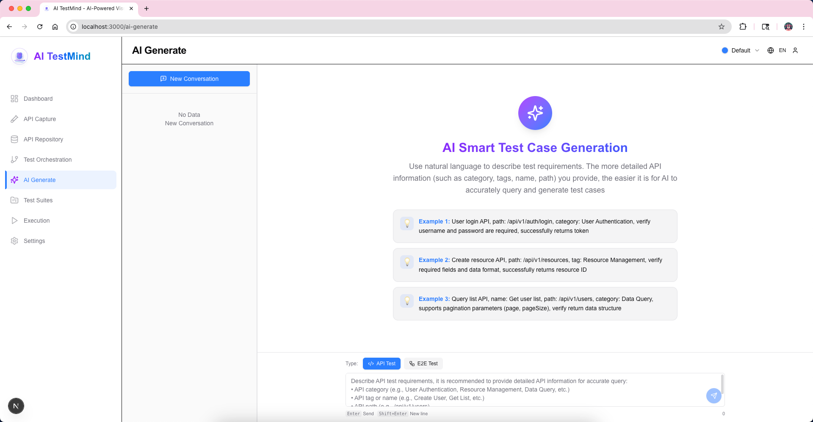
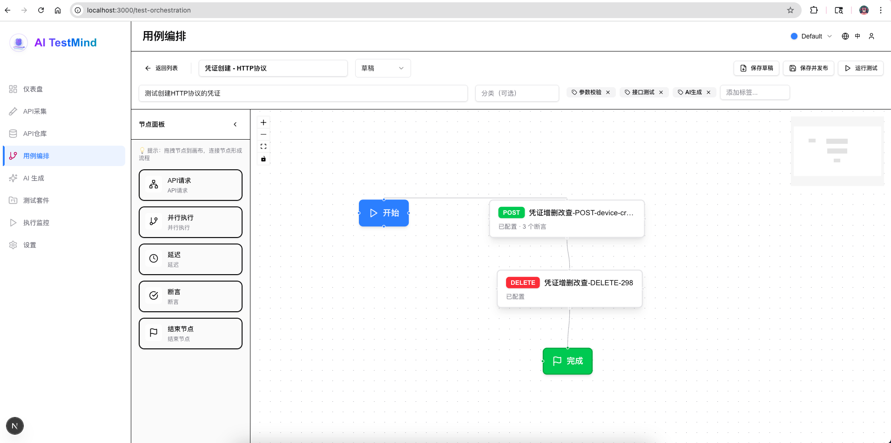
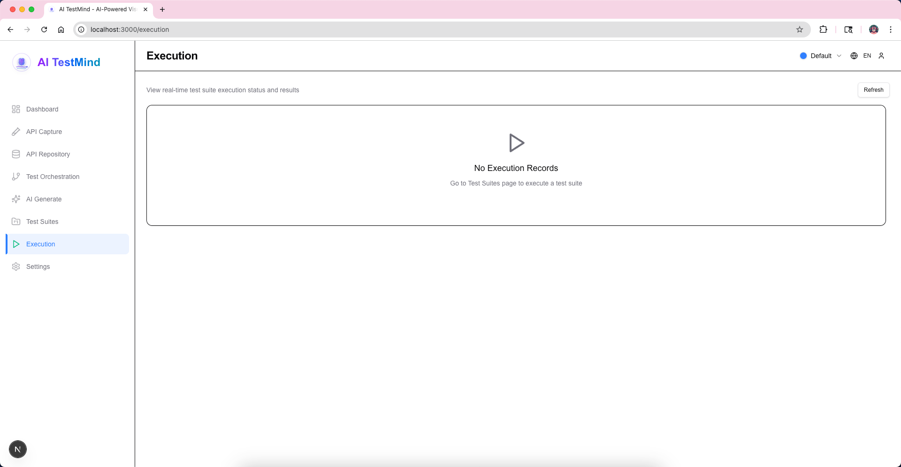

<div align="center">


<h1>🧠 AI TestMind</h1>

<p><strong>Think in Flows, Test with Intelligence</strong></p>
<p>AI-Powered Visual API Test Orchestration Platform</p>

<!-- Badges -->
[](https://github.com/bobby-sheng/aitestmind/stargazers)
[](https://discord.gg/Kys4DcgNeC)
[](LICENSE)
[](https://hub.docker.com/r/simonbo106/aitestmind)
[](https://hub.docker.com/r/simonbo106/aitestmind)
[](https://nextjs.org/)
[](https://www.typescriptlang.org/)
[](https://openai.com)

<p>
  <a href="#-quick-start">🚀 Quick Start</a> •
  <a href="docs/README.md">📖 Documentation</a> •
  <a href="#-community">💬 Community</a> •
  <a href="https://github.com/bobby-sheng/aitestmind/issues">🐛 Report Bug</a>
</p>

<p>
  <strong>Languages:</strong>
  <a href="README_EN.md">English</a> |
  <a href="README.md">中文</a>
</p>

</div>

---

## 🎯 Why We Built This

**The Problem:**
As a QA engineer and developer, I spent countless hours trying various testing platforms - from commercial tools like Postman and JMeter to enterprise solutions like MeterSphere and Katalon. I also tried writing custom test automation code. But they all shared the same frustrations:

- 📝 **Too much manual work**: Writing repetitive test code for similar scenarios
- 🐌 **Slow test creation**: Simple API tests taking hours to set up
- 🔄 **Poor reusability**: Copying and pasting code across test cases
- 🧩 **Steep learning curve**: Complex tools requiring weeks to master

**The Solution:**
I decided to build the testing platform I always wished existed. AI TestMind is born from my years of hands-on automation testing experience - it's an evolved version of my own testing framework, designed to eliminate repetitive work and make test creation enjoyable and efficient.

**The Result:**
- ⚡ **Fast**: Create complex test flows in minutes, not hours
- 🎨 **Visual**: No coding required - just drag, drop, and connect
- 🤖 **Intelligent**: AI understands your intent and generates complete tests
- 😊 **Delightful**: Finally, a testing tool that's actually pleasant to use

---

## 🚀 Quick Start

### 🐳 **Option 1: Docker Deployment (Recommended)**

#### Option A: Pull from Docker Hub (Fastest)

```bash
docker run -d \
  --name aitestmind \
  -p 3000:3000 \
  -p 8001:8001 \
  -p 8899:8899 \
  -e DATABASE_URL="file:/app/prisma/dev.db" \
  -e EXECUTOR_URL="http://localhost:8001" \
  -v $(pwd)/logs:/app/logs \
  simonbo106/aitestmind:latest

# Visit application
open http://localhost:3000
```

> **📦 Docker Hub:** https://hub.docker.com/r/simonbo106/aitestmind
> 
> **⚠️ Note:** Docker Hub image is optimized for ARM64. For x86_64 servers, use Option B to build locally.

#### Option B: Build Docker Locally (Recommended for Server Deployment)

```bash
# 1. Clone repository
git clone https://github.com/bobby-sheng/aitestmind.git
cd aitestmind

# 2. Build image (⚠️ Must specify your server IP)
docker build -f Dockerfile.all-in-one \
  --build-arg NEXT_PUBLIC_EXECUTOR_URL=http://YOUR_SERVER_IP:8001 \
  -t aitestmind:latest .

# 3. Run container
docker run -d \
  --name aitestmind \
  -p 3000:3000 \
  -p 8001:8001 \
  -p 8899:8899 \
  -e DATABASE_URL=file:/app/prisma/dev.db \
  -v $(pwd)/logs:/app/logs \
  --restart unless-stopped \
  aitestmind:latest
```

> **💡 Why build locally?**
> - Supports custom `NEXT_PUBLIC_EXECUTOR_URL` (browser access to executor)
> - Compatible with different CPU architectures (x86_64/AMD64)
> - If browser shows `Failed to fetch`, rebuild with correct server IP

---

### 💻 **Option 2: Local Setup**

```bash
# 1. Clone repository
git clone https://github.com/bobby-sheng/aitestmind.git
cd aitestmind

# 2. Run setup script (auto-completes all configuration and build)
chmod +x setup.sh
./setup.sh

# 3. Start frontend (Terminal 1)
npm run start

# 4. Start executor (Terminal 2)
cd executor
source venv/bin/activate
python main.py
```

**📝 Default admin account:** `admin / admin123`

**🎉 Done!** Visit http://localhost:3000

---

## 💡 What is AI TestMind?

**AI TestMind** is a next-generation API testing platform that combines **AI intelligence** with **visual workflow orchestration**. Transform natural language descriptions into executable test flows in seconds.

### ✨ From Words to Workflows

```
"Test user login, then create an order"
              ↓
    [AI TestMind thinks...]
              ↓
┌────────┐   ┌──────┐   ┌───────┐
│ Login  │──▶│ Cart │──▶│ Order │
│ API    │   │ API  │   │ API   │
└────────┘   └──────┘   └───────┘
  ✅ Assert    ✅ Extract  ✅ Cleanup
  status=200   token      DELETE order
```

---

## 🌟 Why AI TestMind?

### 🚀 **10x Faster Test Creation**

| Feature | AI TestMind | Postman | JMeter | MeterSphere | Katalon |
|---------|------------|---------|--------|-------------|---------|
| **🤖 AI Generation** | ✅ GPT-4 Powered | ❌ Manual | ❌ Manual | ❌ Manual | ⚠️ Limited |
| **🎨 Visual Flow Builder** | ✅ Drag & Drop | ⚠️ Limited | ❌ XML/Code | ⚠️ Limited | ✅ Yes |
| **📊 Real-time Monitoring** | ✅ Live Dashboard | ⚠️ Post-run | ✅ Yes | ✅ Yes | ⚠️ Limited |
| **🎬 Smart API Capture** | ✅ 3 Modes | ⚠️ Browser Only | ❌ Manual | ⚠️ HAR Only | ⚠️ Basic |
| **🧩 Learning Curve** | 🟢 **5 minutes** | 🟡 1 hour | 🔴 2 days | 🟡 2 hours | 🟡 1 day |
| **🌐 Multi-language** | ✅ EN/CN | ✅ Multiple | ⚠️ Limited | ✅ CN/EN | ✅ Multiple |
| **💰 Cost** | 🟢 **Free & Open Source** | 🟡 Freemium | 🟢 Free | 🟢 Open Source | 🔴 Paid |

### 🎯 **Key Advantages**

- 🧠 **AI-Driven**: Natural language → Complete test flows
- 🎨 **Visual First**: No coding required, drag & drop
- ⚡ **Real-time**: Watch tests execute live with detailed logs
- 🎬 **Smart Capture**: Browser recording, HAR import, mitmproxy support
- 🌍 **Multi-language**: Built-in English & Chinese support
- 🎨 **Theme Customization**: Light/Dark mode with customizable color schemes
- 🔧 **Extensible**: Plugin system & custom functions
- 🐳 **Easy Deploy**: Docker, Windows, Linux, macOS

---

## ✨ Core Features

### 🤖 **AI-Powered Test Generation**


**Simply describe what you want to test:**

```
"Test creating a high-availability group, 
name and deliveryMethod are required,
returns id and createTime on success"
```

**AI automatically:**
- 🔍 Searches relevant APIs from your repository
- ✨ Generates 3 test cases (success + edge cases)
- 🎯 Creates intelligent assertions
- 🧹 Adds cleanup steps for success cases
- 💾 Saves directly to database

**Supported AI Providers:**
- OpenAI (GPT-4, GPT-3.5)
- DeepSeek
- Claude (Anthropic)
- 百度文心一言 (Baidu)
- 阿里通义千问 (Alibaba)
- 智谱 AI (Zhipu)
- Ollama (Self-hosted)

[📖 Learn more →](docs/user-guide/03_AI_GENERATION.md)

---

### 🎨 **Visual Flow Orchestration**

<div align="center">

</div>

**Build complex test scenarios visually:**

- 🎯 **Drag & Drop Nodes**: API, Parallel, Wait, Assertion
- 🔗 **Smart Connections**: Automatic variable extraction & reference
- ✅ **Rich Assertions**: Status, JSONPath, Response Time, Custom
- 🔀 **Flow Control**: Sequential, Parallel execution
- 💾 **Real-time Save**: Auto-save with undo/redo support

**Node Types:**
- 🌐 **API Node**: HTTP request with headers, body, auth
- ⚡ **Parallel Node**: Execute multiple APIs concurrently
- ⏱️ **Wait Node**: Delay or wait for conditions
- 🎯 **Assertion Node**: Validate responses
- 🧹 **Cleanup Node**: Post-execution cleanup

[📖 Learn more →](docs/user-guide/04_FLOW_ORCHESTRATION.md)

---

### 🎬 **Smart API Capture - 3 Modes**

<div align="center">

</div>

**Choose the right capture mode for your needs:**

| Mode | Use Case | HTTPS Support | Setup Complexity | Best For |
|------|----------|---------------|------------------|----------|
| 🌐 **Browser** | Local development | ✅ Full | 🟢 Easy | Quick testing |
| 🔗 **HTTP Proxy** | Fast testing | ⚠️ Tunnel only | 🟡 Medium | Simple HTTP APIs |
| 🛡️ **mitmproxy** | Production testing | ✅ Full decrypt | 🟡 Medium | Complete testing |

**🔒 mitmproxy - Professional Traffic Capture**

Perfect for mobile apps, mini programs, and complete HTTPS traffic capture.

**Quick Start:**
```bash
# 1. Access Web UI
Visit http://localhost:3000/api-capture
Select "mitmproxy Proxy Recording" → Click "Start Recording"

# 2. Configure System Proxy
macOS: System Settings → Network → Proxies → HTTP/HTTPS → localhost:8899
Windows: Settings → Network → Proxy → Manual → localhost:8899

# 3. Install HTTPS Certificate (First Time)
Visit http://mitm.it → Download certificate → Install and trust

# 4. Start Capturing
Access any website or launch app → View captured requests in real-time
```

**🌐 Standalone Chrome Browser with Proxy (Recommended):**

Launch an isolated Chrome instance with proxy without affecting your existing browser:

```bash
# Windows (CMD)
start chrome --proxy-server="YOUR_SERVER_IP:8899" --user-data-dir="C:\Temp\ChromeProxyProfile"

# Windows (PowerShell)
& "C:\Program Files\Google\Chrome\Application\chrome.exe" --proxy-server="YOUR_SERVER_IP:8899" --user-data-dir="C:\Temp\ChromeProxyProfile"

# macOS
/Applications/Google\ Chrome.app/Contents/MacOS/Google\ Chrome --proxy-server="YOUR_SERVER_IP:8899" --user-data-dir="/tmp/ChromeProxyProfile"

# Linux
google-chrome --proxy-server="YOUR_SERVER_IP:8899" --user-data-dir="/tmp/ChromeProxyProfile"
```

> 💡 The `--user-data-dir` parameter creates an isolated browser profile without your bookmarks, extensions, or login sessions.

**Key Features:**
- 🔐 **Full HTTPS Support**: Automatic HTTPS decryption
- 📊 **Real-time Push**: SSE technology for instant display
- 🎯 **Precise Control**: Start, pause, resume, stop, clear
- 🗂️ **Complete Data**: Headers, params, body fully captured
- 💾 **Batch Save**: Save selected requests to API repository

📖 **Full Guide**: [mitmproxy Complete Documentation →](docs/user-guide/05_API_CAPTURE.md#mitmproxy-mode)

---

**Common Features:**
- 📡 Real-time capture with filtering
- 🎯 Auto-classification (XHR, API, Static)
- 📋 HAR file import support
- 💾 Batch save to repository
- 🏷️ Smart tagging & categorization

[📖 Learn more →](docs/user-guide/05_API_CAPTURE.md)

---

### 📊 **Real-time Execution Monitoring**

<div align="center">

</div>

**Watch your tests execute in real-time:**

- 📊 **Live Dashboard**: Real-time status updates via SSE
- 🎯 **Node-level Logs**: Click any node to see detailed execution
- ⏸️ **Pause/Resume**: Control execution flow
- 🔄 **Retry Failed**: One-click retry for failed tests
- 📝 **Detailed Reports**: Request/response, timings, assertions
- 📈 **Execution History**: Track trends over time

[📖 Learn more →](docs/user-guide/06_EXECUTION.md)

---

## 🏗️ Architecture

### 🔧 **Tech Stack**

**Frontend:**
```
Next.js 16 + React 19 + TypeScript
├── UI: shadcn/ui + Tailwind CSS 4.0
├── Theme: Light/Dark mode, customizable colors
├── Flow Editor: React Flow
├── State: React Query + Context
└── i18n: next-intl
```

**Backend:**
```
Node.js + Python
├── API: Next.js API Routes
├── Database: SQLite + Prisma ORM
├── Executor: Python (FastAPI)
├── Automation: Playwright
└── Capture: mitmproxy
```

**AI Integration:**
```
Multi-Provider Support
├── OpenAI (GPT-4, GPT-3.5)
├── DeepSeek
├── Claude
├── Baidu (文心一言)
├── Alibaba (通义千问)
├── Zhipu (智谱 AI)
└── Ollama (Self-hosted)
```

### 📐 **System Architecture**



---

## 🎬 Screenshots & Demos

### 📸 **Product Screenshots**

<details>
<summary>📊 <strong>Dashboard</strong> - Overview and analytics</summary>


</details>

<details>
<summary>🗂️ <strong>API Repository</strong> - Manage your API collection</summary>



</details>

<details>
<summary>🤖 <strong>AI Generation</strong> - Natural language to tests</summary>



</details>

<details>
<summary>🎨 <strong>Flow Builder</strong> - Visual test orchestration</summary>



</details>

<details>
<summary>📊 <strong>Execution Monitor</strong> - Real-time test execution</summary>



</details>


## 🎯 Use Cases

### ✅ **E-commerce Testing**

```
Test Scenario: Complete Purchase Flow
├── User Login
├── Browse Products
├── Add to Cart (Parallel)
│   ├── Product A
│   ├── Product B
│   └── Product C
├── Apply Coupon
├── Checkout
├── Payment
└── Cleanup: Delete Test Order ✨
```

### ✅ **Microservices Testing**

```
Test Scenario: Service Orchestration
├── Authentication Service
│   └── Extract: accessToken
├── User Service (Parallel)
│   ├── Create Profile
│   ├── Update Preferences
│   └── Upload Avatar
├── Notification Service
│   └── Assert: Email sent
└── Audit Service
    └── Verify: All actions logged
```

### ✅ **CI/CD Integration**

```yaml
# .github/workflows/api-tests.yml
name: API Tests
on: [push, pull_request]

jobs:
  test:
    runs-on: ubuntu-latest
    steps:
      - uses: actions/checkout@v2
      - name: Run AI TestMind Tests
        run: |
          docker-compose up -d
          npm run test:api
```

---

## 🌟 Testimonials

> **"AI TestMind increased our testing efficiency by 300%! The AI generation feature is a game-changer."**
> 
> — Senior QA Engineer, E-commerce Platform

> **"Finally, a testing tool that actually understands natural language. The visual flow builder makes complex scenarios simple."**
> 
> — Tech Lead, SaaS Company

> **"We replaced 3 tools with AI TestMind. The real-time monitoring and detailed logs save us hours every day."**
> 
> — DevOps Manager, FinTech Startup

---

## 📊 Project Stats

<div align="center">


</div>

---

## 📚 Documentation & Configuration

### 📖 **Documentation Center**

| Document | Description |
|----------|-------------|
| [Docker Quick Start](docs/deployment/QUICK_START_DOCKER.md) | Docker deployment guide |
| [Full Deployment Guide](docs/deployment/DEPLOYMENT_GUIDE.md) | Complete deployment docs |
| [Environment Variables](env.example) | Configuration options |
| [Documentation Center](docs/README.md) | Full documentation index |

### ⚠️ **Common Issue: Executor Connection Failed**

If browser shows `Failed to fetch` or `Executor address correct: http://localhost:8001`:

**Cause:** `NEXT_PUBLIC_EXECUTOR_URL` is misconfigured

**Solution:**

```bash
# 1. Update executor URL in .env to your server IP
NEXT_PUBLIC_EXECUTOR_URL=http://YOUR_SERVER_IP:8001

# 2. Rebuild (Important! NEXT_PUBLIC_ variables are embedded at build time)
npm run build

# 3. Restart service
npm run start
```

> **💡 Tip:** For Docker deployment, pass `--build-arg NEXT_PUBLIC_EXECUTOR_URL=http://YOUR_SERVER_IP:8001` at build time

---

## 🤝 Contributing

We welcome contributions from the community! 🎉

### 🌟 **How to Contribute**

1. 🍴 Fork the repository
2. 🌿 Create your feature branch (`git checkout -b feature/amazing-feature`)
3. 💾 Commit your changes (`git commit -m 'feat: add amazing feature'`)
4. 📤 Push to the branch (`git push origin feature/amazing-feature`)
5. 🎉 Open a Pull Request

### 📝 **Contribution Guidelines**

- Follow [Conventional Commits](https://www.conventionalcommits.org/)
- Write tests for new features
- Update documentation
- Ensure CI passes

[📖 Full Contributing Guide →](CONTRIBUTING.md)

### 🏆 **Contributors**

<a href="https://github.com/bobby-sheng/aitestmind/graphs/contributors">
  
</a>

---

## 💬 Community

Join our growing community!

### 🌍 **International Community**

<div align="center">

[](https://discord.gg/Kys4DcgNeC)

**[🎮 Join our Discord Server](https://discord.gg/Kys4DcgNeC)**

Connect with developers worldwide on Discord - get technical support, share experiences, and participate in project discussions!

</div>

### 🇨🇳 **Chinese Community 中文社区**

<div align="center">

| WeChat Group 微信群 | Feishu Group 飞书群 |
|:---:|:---:|
|  |  |
| Scan to join WeChat group | Scan to join Feishu group |

</div>

### 💡 **Community Activities**

- 📢 **Weekly Tech Talks**: Latest features and best practices
- 🐛 **Bug Reports & Discussions**: Quick responses and solutions
- 💬 **User Exchange**: Share experiences and testing tips
- 🎯 **Feature Requests**: Participate in roadmap discussions
- 🏆 **Contributor Recognition**: Acknowledge community contributions

</div>


---

## ⭐ Star History

[](https://star-history.com/#bobby-sheng/aitestmind&Date)

---

## 📄 License

This project is licensed under **Non-Commercial Use License** - see the [LICENSE](LICENSE) file for details.

### ✅ Allowed Use

- 📚 **Personal Learning**: Study, research, experimentation
- 🎓 **Educational**: Teaching, training, academic research
- 🏠 **Personal Projects**: Personal use, non-profit purposes

### ❌ Prohibited Use

- 🏢 **Commercial Use**: Companies, enterprises, commercial projects
- 💰 **Paid Services**: Providing paid services, SaaS platforms
- 🔄 **Reselling**: Selling or distributing to commercial customers

### 💼 Commercial License

If you need to use this project for commercial purposes:
- 🏢 Enterprise internal use
- 💰 Commercial services
- 🔧 Client customization

Please contact the author for commercial licensing:
- 📧 Email: simonboz@outlook.com
- 💬 WeChat 微信:

<div align="center">

<p>Scan to add WeChat | 扫码添加微信</p>
</div>

---

## 🙏 Acknowledgments

Built with ❤️ by the AI TestMind team and contributors.

**Inspired by:**
- [MeterSphere](https://metersphere.io) - Comprehensive testing platform
- [Postman](https://postman.com) - API development platform
- [n8n](https://n8n.io) - Workflow automation
- [Playwright](https://playwright.dev) - Browser automation

**Special Thanks:**
- All [contributors](https://github.com/bobby-sheng/aitestmind/graphs/contributors)
- Open source community
- Early adopters and testers
- AI providers (OpenAI, DeepSeek, etc.)

---

<div align="center">

### ⭐ **If you find AI TestMind helpful, please give us a star!** ⭐

**Think in Flows, Test with Intelligence** 🧠

Made with ❤️ by developers, for developers

[⬆ Back to Top](#-ai-testmind)

</div>
