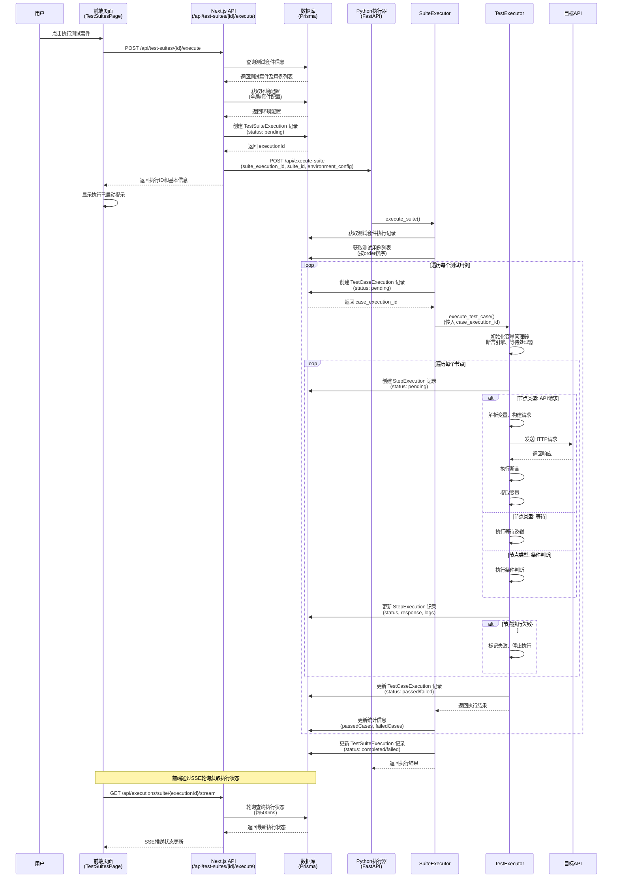
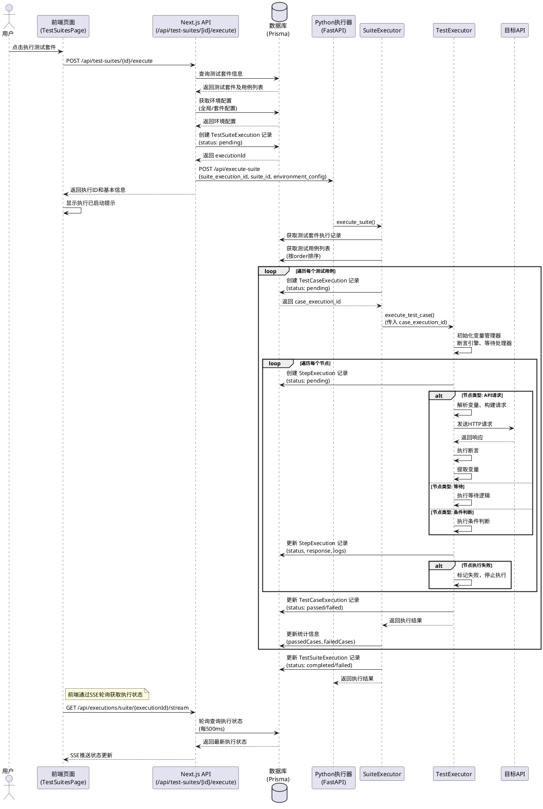
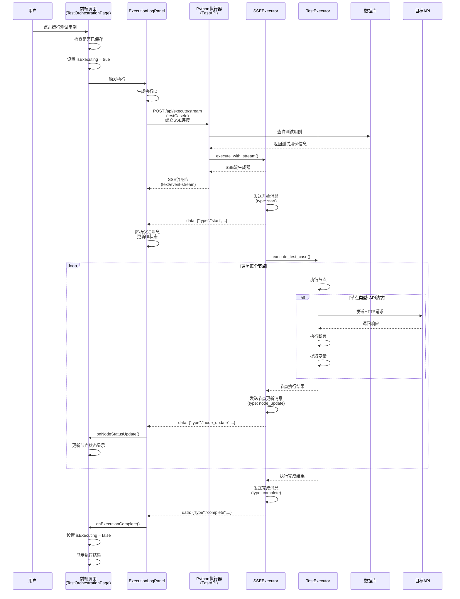
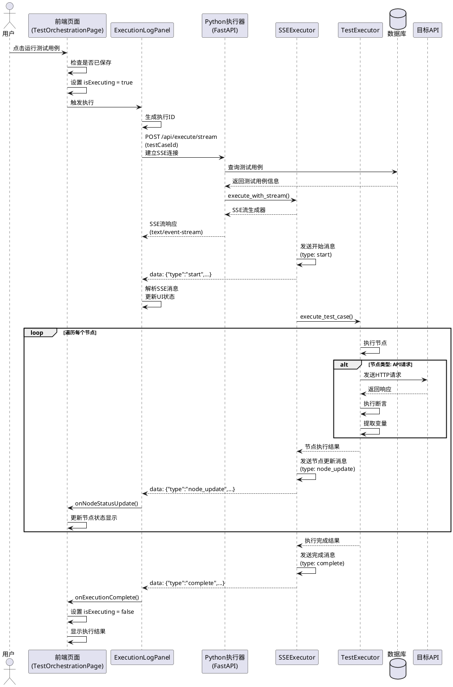
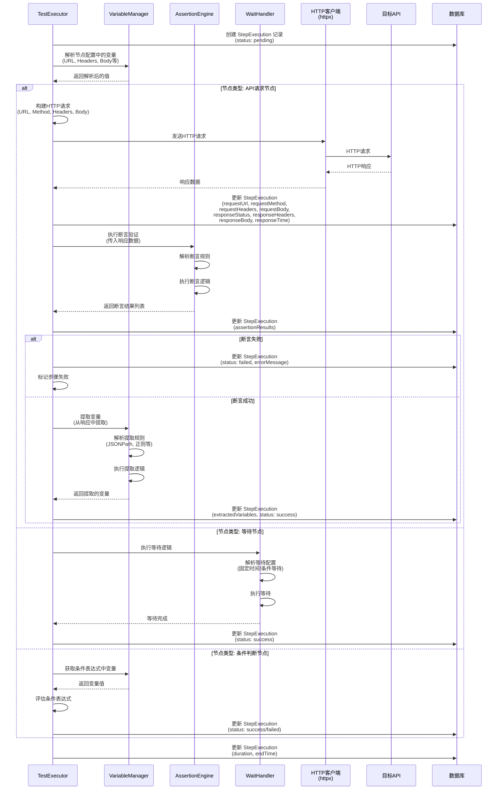
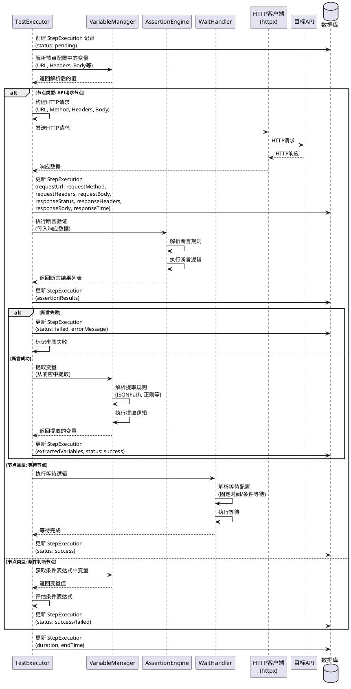

# 项目流程时序图

本文档描述了 API 智能测试平台的核心业务流程时序图。

## 目录

1. [测试套件执行流程](#1-测试套件执行流程)
2. [单个测试用例执行流程（SSE实时推送）](#2-单个测试用例执行流程sse实时推送)
3. [测试用例节点执行流程](#3-测试用例节点执行流程)

---

## 1. 测试套件执行流程

### 流程说明

测试套件执行是平台的核心功能，支持批量执行多个测试用例。流程包括：
- 前端触发执行
- Next.js API 创建执行记录
- Python 执行器异步执行
- 数据库记录执行结果
- SSE 实时推送执行状态

### 时序图代码（Mermaid）



### 时序图代码（PlantUML）



---

## 2. 单个测试用例执行流程（SSE实时推送）

### 流程说明

单个测试用例执行支持实时推送执行进度，通过 SSE (Server-Sent Events) 实现。流程包括：
- 前端通过 SSE 连接执行器
- 执行器实时推送节点执行状态
- 前端实时更新UI显示

### 时序图代码（Mermaid）



### 时序图代码（PlantUML）



---

## 3. 测试用例节点执行流程

### 流程说明

详细描述单个节点的执行流程，包括变量解析、请求发送、断言验证、变量提取等步骤。

### 时序图代码（Mermaid）



### 时序图代码（PlantUML）



---

## 关键组件说明

### 前端组件

- **TestSuitesPage**: 测试套件列表页面，提供执行入口
- **TestOrchestrationPage**: 测试用例编排页面，支持单个用例执行
- **ExecutionLogPanel**: 执行日志面板，处理SSE连接和实时更新
- **CaseExecutionDialog**: 用例执行详情对话框，显示执行结果

### 后端API

- **Next.js API Routes**: 
  - `/api/test-suites/[id]/execute`: 执行测试套件
  - `/api/executions/suite/[executionId]/stream`: SSE流推送执行状态
- **Python FastAPI**:
  - `/api/execute-suite`: 执行测试套件（批量）
  - `/api/execute/stream`: 执行单个测试用例（SSE实时推送）

### 执行器组件

- **SuiteExecutor**: 测试套件执行器，负责批量执行多个测试用例
- **TestExecutor**: 测试用例执行器，负责执行单个测试用例
- **SSEExecutor**: SSE执行器，支持实时推送执行进度
- **VariableManager**: 变量管理器，处理变量解析和提取
- **AssertionEngine**: 断言引擎，执行断言验证
- **WaitHandler**: 等待处理器，处理等待逻辑

### 数据库模型

- **TestSuiteExecution**: 测试套件执行记录
- **TestCaseExecution**: 测试用例执行记录
- **StepExecution**: 步骤执行记录
- **ExecutionLog**: 执行日志记录

---

## 执行状态流转

### 测试套件执行状态

```
pending → running → completed/failed/stopped
```

### 测试用例执行状态

```
pending → running → passed/failed
```

### 步骤执行状态

```
pending → running → success/failed/skipped
```

---

## 注意事项

1. **异步执行**: 测试套件执行是异步的，前端通过SSE轮询获取状态
2. **错误处理**: 每个层级都有错误处理机制，确保执行失败时能正确记录
3. **变量作用域**: 变量在测试用例级别共享，可在节点间传递
4. **后置清理**: 即使普通节点失败，后置清理节点仍会执行
5. **停止机制**: 支持手动停止执行，通过stop_flags实现

---

## 相关文件

- `app/api/test-suites/[id]/execute/route.ts`: 测试套件执行API
- `app/api/executions/suite/[executionId]/stream/route.ts`: SSE流推送API
- `executor/main.py`: Python执行器主入口
- `executor/suite_executor.py`: 测试套件执行器
- `executor/test_executor.py`: 测试用例执行器
- `executor/sse_executor.py`: SSE执行器
- `components/test-orchestration/ExecutionLogPanel.tsx`: 执行日志面板
- `components/reports/CaseExecutionDialog.tsx`: 用例执行详情对话框
